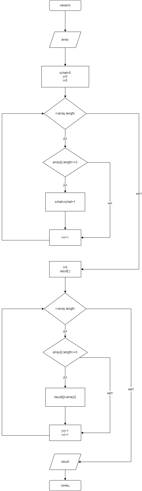

# gb_ItogTest
Задача : Создать репозиторий на GitHub с README файлом, В репозитории должна быть помещена программа, которая из имеющегося массива строк формирует новый массив из строк, длинна которых меньше или равна 3, а ткже блок схема этой программы.
в папке __test__ находится файл __Program.cs__, который выполняет поставленную задучу.
